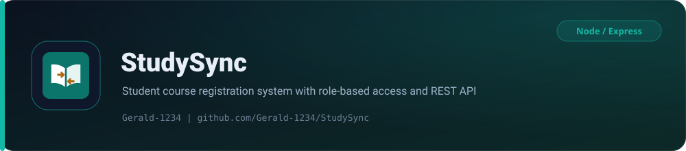

<p align="center">
  <picture>
    
  </picture>
</p>

<p align="center">
  <strong>A beginner-friendly Student Course Registration System for a university tutorial centre.</strong>
</p>

<p align="center">
  
  
  
</p>
<p align="center">
  
  
  
</p>
<p align="center">
  
  
  
</p>

StudySync manages student records, course enrolment, semesters, instructors and instructor-to-course assignments behind a JWT-authenticated REST API. The frontend never receives the Supabase secret key; every database request passes through the Express API.

## Architecture

| Part | Technology | Deployment |
| --- | --- | --- |
| Frontend | Separate HTML pages, CSS, vanilla ES-module JavaScript | Cloudflare Pages |
| Backend | Node.js 20+, Express 5, JWT authentication | Render |
| Database | PostgreSQL through Supabase | Supabase |

Row Level Security is enabled without browser policies because the frontend must use the Express API. The backend uses a service key that stays on the server.

## User roles

| Role | Core responsibility |
| --- | --- |
| Administrator | Creates accounts, assigns roles and activates or deactivates accounts |
| Registration Officer | Registers students and enrols them in courses |
| Tutorial Centre Manager | Manages courses, semesters, instructors, assignments and reports |
| Instructor | Views assigned courses and class lists |

## Core features

- Secure email and password login with account lockout after repeated failures.
- Role-based page routing and API permissions.
- Student registration and profile updates.
- Course and academic-semester management.
- Student enrolment in one or more courses, with duplicate-enrolment prevention.
- Instructor login account and teaching profile created together.
- One active instructor assignment per course and semester.
- Course-enrolment and instructor-assignment reports, plus instructor class lists.
- Audit logging for important changes.

Fees, attendance, results, timetables, SMS, online lessons and parent portals are intentionally outside the first version.

## Tech stack

| Layer | Choice |
| --- | --- |
| Frontend | HTML5, CSS3, vanilla JavaScript (ES modules), hash-free multi-page layout |
| Backend | Node.js 20+, Express 5 (CommonJS) |
| Database | PostgreSQL on Supabase, service-key client, RLS enabled |
| Auth | JWT (HS256) issued as bearer tokens, bcryptjs password hashing |
| Security | Helmet, compression, CORS allow-list, `express-rate-limit`, Cloudflare security headers |
| Tests | Node built-in `node:test` |
| Hosting | Render (API), Cloudflare Pages (frontend) |

## Repository structure

```text
StudySync/
  client/                 Role-specific pages and shared assets
    admin/
    registration/
    manager/
    instructor/
    assets/
    index.html
    404.html
  database/               schema.sql and database notes
  server/
    src/
      config/             Supabase client and environment handling
      controllers/        Route handlers
      middleware/         Auth and role guards
      routes/             Express routers
      scripts/            createAdmin.js seed script
      utils/              Validation and helpers
    test/                 node:test suites
    .env.example
    package.json
    server.js
  render.yaml             Render Blueprint
  wrangler.toml           Cloudflare Pages configuration
  DEVELOPERS.md           Detailed implementation guide
  LICENSE                 MIT
```

Each role has real HTML pages in its own folder. JavaScript handles API calls and fills existing tables and form controls; it does not generate the page structure.

## Local setup

### 1. Create the Supabase database

1. Create or open the Supabase project.
2. Open the Supabase SQL Editor and run [`database/schema.sql`](database/schema.sql).
3. Copy the project URL and backend secret key.

### 2. Configure the server

From the project root:

```powershell
Copy-Item server\.env.example server\.env
```

Fill in `server/.env`:

```env
NODE_ENV=development
PORT=5000
CLIENT_URL=http://localhost:5500,http://127.0.0.1:5500
SUPABASE_URL=https://your-project.supabase.co
SUPABASE_SECRET_KEY=your-supabase-secret-key
JWT_SECRET=replace-this-with-at-least-32-random-characters
JWT_EXPIRES_IN=8h
ADMIN_FIRST_NAME=System
ADMIN_LAST_NAME=Administrator
ADMIN_EMAIL=admin@studysync.local
ADMIN_PASSWORD=Encrypted.01
```

`JWT_SECRET` must be at least 32 characters. Never place `SUPABASE_SECRET_KEY` in `client/`.

### 3. Install and start the API

```powershell
Set-Location server
npm install
npm run create-admin
npm run dev
```

The API runs at `http://localhost:5000` with a health endpoint at `http://localhost:5000/api/health`.

### 4. Start the frontend

From another terminal in the project root:

```powershell
python -m http.server 5500 --directory client
```

Then open `http://localhost:5500`.

## Default admin credentials

`npm run create-admin` creates the administrator account below from the `ADMIN_*` values in `server/.env`, so the system can be accessed right after setup:

| Role | Email | Password |
| --- | --- | --- |
| Administrator | `admin@studysync.local` | `Encrypted.01` |

These are demo credentials for trying the app. Change the `ADMIN_*` values in `server/.env` (and re-run `npm run create-admin`) before any real deployment.

## Recommended demo order

1. Sign in as the administrator and create registration officer, manager and instructor accounts. Creating an instructor also creates the linked teaching profile.
2. Sign in as the manager and create a semester and courses.
3. Sign in as the registration officer and register students.
4. Enrol the students in courses.
5. Sign in as the manager and assign instructors.
6. Open the reports page.
7. Sign in as an instructor and show the class list.

## Deployment

### Render backend

1. Push the project to GitHub.
2. Create a Render Blueprint from the repository; Render reads [`render.yaml`](render.yaml).
3. Add `SUPABASE_URL`, `SUPABASE_SECRET_KEY` and `CLIENT_URL`.
4. Confirm that `/api/health` returns a successful response.

If Render assigns a different service address than `client/assets/js/config.js` and `client/_headers` expect, update both files.

### Cloudflare Pages frontend

The repository includes [`wrangler.toml`](wrangler.toml), which deploys the `client/` folder to Cloudflare Pages.

```bash
npx wrangler pages deploy client
```

Alternatively, connect the repository in the Cloudflare dashboard and set the output directory to `client`, then copy the Cloudflare Pages URL into Render's `CLIENT_URL`.

## Verification

```powershell
Set-Location server
npm test
```

The suite uses Node's built-in test runner and covers input validation, role-permission behaviour and instructor-account provisioning.

## Documentation

- [`DEVELOPERS.md`](DEVELOPERS.md) contains the detailed implementation and API contract.

## License

Released under the [MIT License](LICENSE).

<p align="center"><sub>Built and maintained by <a href="https://github.com/Gerald-1234">Gerald-1234</a></sub></p>
